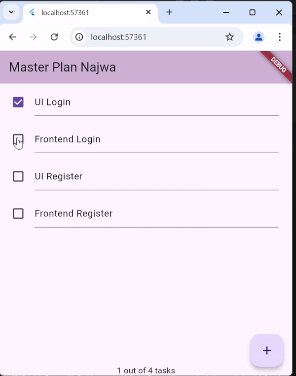
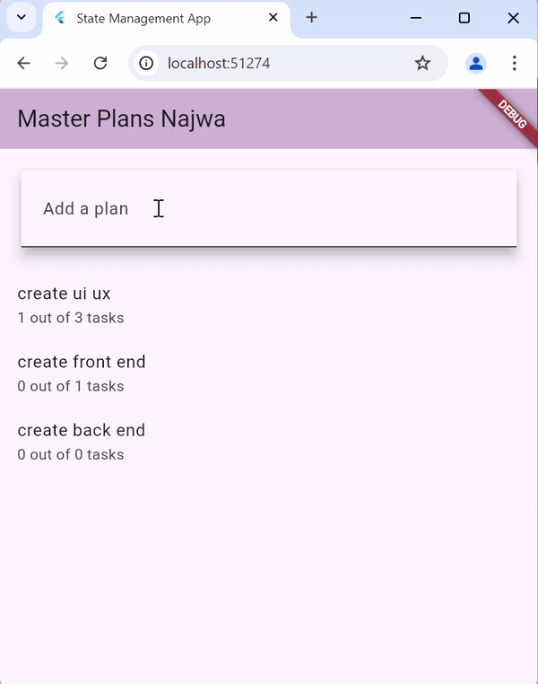
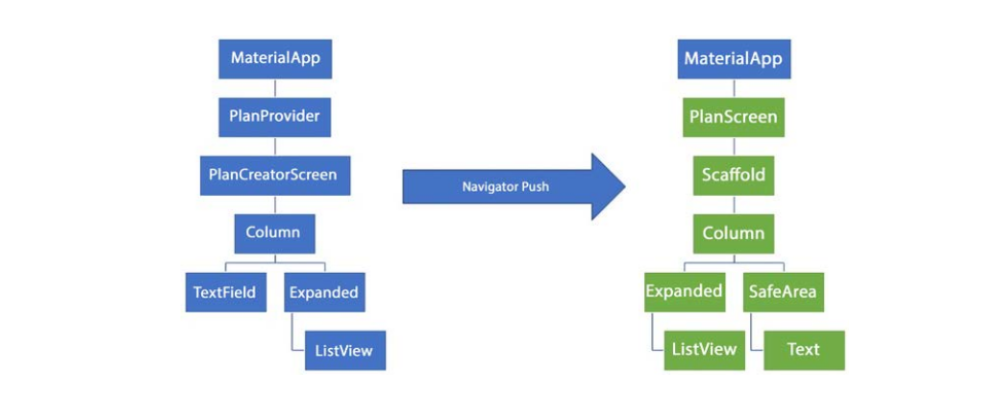

# Laporan Jobsheet 11 Dasar State Management

- **Nama**: Najwa Azzahra
- **Kelas**: TI-3C
- **NIM**: 2241720139

## Praktikum 1: Dasar State dengan Model-View

**plan_screen.dart**

```dart
import '../model/data_layer.dart';
import 'package:flutter/material.dart';

class PlanScreen extends StatefulWidget {
  const PlanScreen({super.key});

  @override
  State createState() => _PlanScreenState();
}

class _PlanScreenState extends State<PlanScreen> {
  Plan plan = const Plan();
  late ScrollController scrollController;

  @override
  void initState() {
    super.initState();
    scrollController = ScrollController()
      ..addListener(() {
        FocusScope.of(context).requestFocus(FocusNode());
      });
  }

  @override
  Widget build(BuildContext context) {
    return Scaffold(
      appBar: AppBar(title: const Text('Master Plan Najwa')),
      body: _buildList(),
      floatingActionButton: _buildAddTaskButton(),
    );
  }

  Widget _buildAddTaskButton() {
    return FloatingActionButton(
      child: const Icon(Icons.add),
      onPressed: () {
        setState(() {
          plan = Plan(
            name: plan.name,
            tasks: List<Task>.from(plan.tasks)..add(const Task()),
          );
        });
      },
    );
  }

  Widget _buildList() {
    return ListView.builder(
      controller: scrollController,
      keyboardDismissBehavior: Theme.of(context).platform == TargetPlatform.iOS
          ? ScrollViewKeyboardDismissBehavior.onDrag
          : ScrollViewKeyboardDismissBehavior.manual,
      itemCount: plan.tasks.length,
      itemBuilder: (context, index) => _buildTaskTile(plan.tasks[index], index),
    );
  }

  Widget _buildTaskTile(Task task, int index) {
    return ListTile(
      leading: Checkbox(
          value: task.complete,
          onChanged: (selected) {
            setState(() {
              plan = Plan(
                name: plan.name,
                tasks: List<Task>.from(plan.tasks)
                  ..[index] = Task(
                    description: task.description,
                    complete: selected ?? false,
                  ),
              );
            });
          }),
      title: TextFormField(
        initialValue: task.description,
        onChanged: (text) {
          setState(() {
            plan = Plan(
              name: plan.name,
              tasks: List<Task>.from(plan.tasks)
                ..[index] = Task(
                  description: text,
                  complete: task.complete,
                ),
            );
          });
        },
      ),
    );
  }

  @override
  void dispose() {
    scrollController.dispose();
    super.dispose();
  }
}
```

**task.dart**

```dart
class Task {
  final String description;
  final bool complete;

  const Task({
    this.complete = false,
    this.description = '',
  });
}
```

**plan.dart**

```dart
import './task.dart';

class Plan {
  final String name;
  final List<Task> tasks;

  const Plan({this.name = '', this.tasks = const []});
}
```

**main.dart**

```dart
import 'package:flutter/material.dart';
import './view/plan_screen.dart';

void main() => runApp(MasterPlanApp());

class MasterPlanApp extends StatelessWidget {
  const MasterPlanApp({super.key});

  @override
  Widget build(BuildContext context) {
    return MaterialApp(
      theme: ThemeData(
          primarySwatch: Colors.purple,
          appBarTheme: AppBarTheme(color: Color.fromARGB(255, 208, 182, 212))),
      home: const PlanScreen(),
    );
  }
}
```

**data_layer.dart**

```dart
export 'plan.dart';
export 'task.dart';
```


### Tugas Praktikum 1

1. Selesaikan langkah-langkah praktikum tersebut, lalu dokumentasikan berupa GIF hasil akhir praktikum beserta penjelasannya di file README.md! Jika Anda menemukan ada yang error atau tidak berjalan dengan baik, silakan diperbaiki.

2. Jelaskan maksud dari langkah 4 pada praktikum tersebut! Mengapa dilakukan demikian?

- Perintah export dalam Dart digunakan untuk membuat API yang lebih bersih dan terstruktur saat mengelola beberapa file dalam proyek. Langkah 4 tersebut digunakan sebagai:
  - Menggabungkan Beberapa File
  - Mengurangi Boilerplate Code
  - Menyediakan API yang Konsisten

3. Mengapa perlu variabel plan di langkah 6 pada praktikum tersebut? Mengapa dibuat konstanta ?

- Variabel plan tersebut berfungsi sebagai model data yang menyimpan informasi terkait rencana dan tugas yang akan dikelola.

4. Lakukan capture hasil dari Langkah 9 berupa GIF, kemudian jelaskan apa yang telah Anda buat!

- 

  **Penjelasan**
  
    Kode program tersebut berfungsi untuk menampilkan daftar tugas, tetapi tidak menangani beberapa aspek pengalaman pengguna yang lebih baik, terutama terkait dengan input teks dan kontrol scrolling.

5. Apa kegunaan method pada Langkah 11 dan 13 dalam lifecyle state ?

- initState(): digunakan untuk inisialisasi dan pengaturan awal, termasuk menambahkan scroll listener untuk mendengarkan event scroll.

- ScrollController dan keyboardDismissBehavior: digunakan untuk mengontrol perilaku scroll dan menangani interaksi keyboard dengan lebih baik, sehingga meningkatkan pengalaman pengguna dalam aplikasi.

6. Kumpulkan laporan praktikum Anda berupa link commit atau repository GitHub ke spreadsheet yang telah disediakan!

## Praktikum 2: Mengelola Data Layer dengan InheritedWidget dan InheritedNotifier

**plan_screen.dart**

```dart
import '../model/data_layer.dart';
import '../provider/plan_provider.dart';
import 'package:flutter/material.dart';

class PlanScreen extends StatefulWidget {
  const PlanScreen({super.key});

  @override
  State createState() => _PlanScreenState();
}

class _PlanScreenState extends State<PlanScreen> {
  // Plan plan = const Plan();
  late ScrollController scrollController;

  @override
  void initState() {
    super.initState();
    scrollController = ScrollController()
      ..addListener(() {
        FocusScope.of(context).requestFocus(FocusNode());
      });
  }

  @override
Widget build(BuildContext context) {
   return Scaffold(
     appBar: AppBar(title: const Text('Master Plan Najwa')),
     body: ValueListenableBuilder<Plan>(
       valueListenable: PlanProvider.of(context),
       builder: (context, plan, child) {
         return Column(
           children: [
             Expanded(child: _buildList(plan)),
             SafeArea(child: Text(plan.completenessMessage))
           ],
         );
       },
     ),
     floatingActionButton: _buildAddTaskButton(context),
   );
}

  Widget _buildAddTaskButton(BuildContext context) {
  ValueNotifier<Plan> planNotifier = PlanProvider.of(context);
  return FloatingActionButton(
    child: const Icon(Icons.add),
    onPressed: () {
      Plan currentPlan = planNotifier.value;
      planNotifier.value = Plan(
        name: currentPlan.name,
        tasks: List<Task>.from(currentPlan.tasks)..add(const Task()),
      );
    },
  );
}

  Widget _buildList(Plan plan) {
   return ListView.builder(
     controller: scrollController,
     itemCount: plan.tasks.length,
     itemBuilder: (context, index) =>
        _buildTaskTile(plan.tasks[index], index, context),
   );
}

  Widget _buildTaskTile(Task task, int index, BuildContext context) {
  ValueNotifier<Plan> planNotifier = PlanProvider.of(context);
  return ListTile(
    leading: Checkbox(
       value: task.complete,
       onChanged: (selected) {
         Plan currentPlan = planNotifier.value;
         planNotifier.value = Plan(
           name: currentPlan.name,
           tasks: List<Task>.from(currentPlan.tasks)
             ..[index] = Task(
               description: task.description,
               complete: selected ?? false,
             ),
         );
       }),
    title: TextFormField(
      initialValue: task.description,
      onChanged: (text) {
        Plan currentPlan = planNotifier.value;
        planNotifier.value = Plan(
          name: currentPlan.name,
          tasks: List<Task>.from(currentPlan.tasks)
            ..[index] = Task(
              description: text,
              complete: task.complete,
            ),
        );
      },
    ),
  );
}

  @override
  void dispose() {
    scrollController.dispose();
    super.dispose();
  }
}
```

**plan_provider.dart**

```dart
import 'package:flutter/material.dart';
import '../model/data_layer.dart';

class PlanProvider extends InheritedNotifier<ValueNotifier<Plan>> {
  const PlanProvider({super.key, required Widget child, required
   ValueNotifier<Plan> notifier})
  : super(child: child, notifier: notifier);

  static ValueNotifier<Plan> of(BuildContext context) {
   return context.
    dependOnInheritedWidgetOfExactType<PlanProvider>()!.notifier!;
  }
}
```

**plan.dart**

```dart
import './task.dart';

class Plan {
  final String name;
  final List<Task> tasks;

  const Plan({this.name = '', this.tasks = const []});
  int get completedCount => tasks
  .where((task) => task.complete)
  .length;

String get completenessMessage =>
  '$completedCount out of ${tasks.length} tasks';
}
```

**main.dart**

```dart
import 'package:flutter/material.dart';
import '../provider/plan_provider.dart';
import './view/plan_screen.dart';
import './model/data_layer.dart';

void main() => runApp(MasterPlanApp());

class MasterPlanApp extends StatelessWidget {
  const MasterPlanApp({super.key});

  @override
  Widget build(BuildContext context) {

    return MaterialApp(
    theme: ThemeData(
    primarySwatch: Colors.purple,
    appBarTheme: AppBarTheme(color: Color.fromARGB(255, 208, 182, 212))),
    home: PlanProvider(
    notifier: ValueNotifier<Plan>(const Plan()),
    child: const PlanScreen(),
   ),
);
  }
}
```



**Penjelasan**
Telah ditambahkan kode program untuk menampilkan progres jumlah task dan task yang telah dicentang pada bagian footer

### Tugas Praktikum 2

1. Selesaikan langkah-langkah praktikum tersebut, lalu dokumentasikan berupa GIF hasil akhir praktikum beserta penjelasannya di file README.md! Jika Anda menemukan ada yang error atau tidak berjalan dengan baik, silakan diperbaiki sesuai dengan tujuan aplikasi tersebut dibuat.

2. Jelaskan mana yang dimaksud InheritedWidget pada langkah 1 tersebut! Mengapa yang digunakan InheritedNotifier?

- Dikarenakan InheritedNotifier adalah subclass dari InheritedWidget yang dirancang untuk memudahkan penggunaan ValueNotifier.
  Berikut adalah kode program InheritedNotifier

```dart
class PlanProvider extends InheritedNotifier<ValueNotifier<Plan>> {
  const PlanProvider({super.key, required Widget child, required
   ValueNotifier<Plan> notifier})
  : super(child: child, notifier: notifier);

  static ValueNotifier<Plan> of(BuildContext context) {
   return context.
    dependOnInheritedWidgetOfExactType<PlanProvider>()!.notifier!;
  }
}
```

3. Jelaskan maksud dari method di langkah 3 pada praktikum tersebut! Mengapa dilakukan demikian?

- Pada langkah 3 dari praktikum tersebut, terdapat dua method yang menggunakan getter dalam Dart untuk menghitung dan memberikan informasi tentang status tugas yang telah diselesaikan.

4. Lakukan capture hasil dari Langkah 9 berupa GIF, kemudian jelaskan apa yang telah Anda buat!
   

**Penjelasan**
Telah ditambahkan kode program untuk menampilkan progres jumlah task dan task yang telah dicentang pada bagian footer

5. Kumpulkan laporan praktikum Anda berupa link commit atau repository GitHub ke spreadsheet yang telah disediakan!

## Praktikum 3: Membuat State di Multiple Screens

**plan_screen.dart**

```dart
import '../model/data_layer.dart';
import '../provider/plan_provider.dart';
import 'package:flutter/material.dart';

class PlanScreen extends StatefulWidget {
  final Plan plan;
  const PlanScreen({super.key, required this.plan});

  @override
  State<PlanScreen> createState() => _PlanScreenState();
}

class _PlanScreenState extends State<PlanScreen> {
  late ScrollController scrollController;
  Plan get plan => widget.plan;

  @override
  void initState() {
    super.initState();
    scrollController = ScrollController()
      ..addListener(() {
        FocusScope.of(context).requestFocus(FocusNode());
      });
  }

  @override
  void dispose() {
    scrollController.dispose();
    super.dispose();
  }

  @override
  Widget build(BuildContext context) {
    ValueNotifier<List<Plan>> plansNotifier = PlanProvider.of(context);
    return Scaffold(
        appBar: AppBar(
             backgroundColor: Color.fromARGB(255, 208, 182, 212),
            title: const Text('Master Plan Najwa Azzahra')),
        body: ValueListenableBuilder<List<Plan>>(
            valueListenable: plansNotifier,
            builder: (context, plans, child) {
              Plan currentPlan = plans.firstWhere((p) => p.name == plan.name);
              return Column(
                children: [
                  Expanded(child: buildList(currentPlan)),
                  SafeArea(child: Text(currentPlan.completenessMessage))
                ],
              );
            }),
        floatingActionButton: _buildAddTaskButton(context));
  }

  Widget buildList(Plan plan) {
    return ListView.builder(
        controller: ScrollController(),
        keyboardDismissBehavior:
            Theme.of(context).platform == TargetPlatform.iOS
                ? ScrollViewKeyboardDismissBehavior.onDrag
                : ScrollViewKeyboardDismissBehavior.manual,
        itemCount: plan.tasks.length,
        itemBuilder: (context, index) =>
            _buildTaskTile(plan.tasks[index], index, context));
  }

  Widget _buildAddTaskButton(BuildContext context) {
    ValueNotifier<List<Plan>> planNotifier = PlanProvider.of(context);
    return FloatingActionButton(
      child: const Icon(Icons.add),
      onPressed: () {
        Plan currentPlan = plan;
        int planIndex =
            planNotifier.value.indexWhere((p) => p.name == currentPlan.name);
        List<Task> updatedTasks = List<Task>.from(currentPlan.tasks)
          ..add(const Task());
        planNotifier.value = List<Plan>.from(planNotifier.value)
          ..[planIndex] = Plan(
            name: currentPlan.name,
            tasks: updatedTasks,
          );
      },
    );
  }

  Widget _buildTaskTile(Task task, int index, BuildContext context) {
    ValueNotifier<List<Plan>> planNotifier = PlanProvider.of(context);

    return ListTile(
      leading: Checkbox(
          value: task.complete,
          onChanged: (selected) {
            Plan currentPlan = plan;
            int planIndex = planNotifier.value
                .indexWhere((p) => p.name == currentPlan.name);
            planNotifier.value = List<Plan>.from(planNotifier.value)
              ..[planIndex] = Plan(
                name: currentPlan.name,
                tasks: List<Task>.from(currentPlan.tasks)
                  ..[index] = Task(
                    description: task.description,
                    complete: selected ?? false,
                  ),
              );
          }),
      title: TextFormField(
        initialValue: task.description,
        onChanged: (text) {
          Plan currentPlan = plan;
          int planIndex =
              planNotifier.value.indexWhere((p) => p.name == currentPlan.name);
          planNotifier.value = List<Plan>.from(planNotifier.value)
            ..[planIndex] = Plan(
              name: currentPlan.name,
              tasks: List<Task>.from(currentPlan.tasks)
                ..[index] = Task(
                  description: text,
                  complete: task.complete,
                ),
            );
        },
      ),
    );
  }
}
```

**plan_provider.dart**

```dart
import 'package:flutter/material.dart';
import '../model/data_layer.dart';

class PlanProvider extends InheritedNotifier<ValueNotifier<Plan>> {
  const PlanProvider({super.key, required Widget child, required
   ValueNotifier<Plan> notifier})
  : super(child: child, notifier: notifier);

  static ValueNotifier<Plan> of(BuildContext context) {
   return context.
    dependOnInheritedWidgetOfExactType<PlanProvider>()!.notifier!;
  }
}
```

**plan.dart**

```dart
import './task.dart';

class Plan {
  final String name;
  final List<Task> tasks;

  const Plan({this.name = '', this.tasks = const []});
  int get completedCount => tasks
  .where((task) => task.complete)
  .length;

String get completenessMessage =>
  '$completedCount out of ${tasks.length} tasks';
}
```

**plan_creator_screen.dart**

```dart
import 'package:flutter/material.dart';
import '../model/plan.dart';
import '../model/data_layer.dart';
import '../provider/plan_provider.dart';
import '../view/plan_screen.dart';

class PlanCreatorScreen extends StatefulWidget {
  const PlanCreatorScreen({super.key});

  @override
  State<PlanCreatorScreen> createState() => _PlanCreatorScreenState();
}

class _PlanCreatorScreenState extends State<PlanCreatorScreen> {
  final textController = TextEditingController();

  void addPlan() {
    final text = textController.text;
    if (text.isEmpty) {
      return;
    }

    final plan = Plan(name: text, tasks: []);

    ValueNotifier<List<Plan>> planNotifier = PlanProvider.of(context);

    planNotifier.value = List<Plan>.from(planNotifier.value)..add(plan);

    textController.clear();
    FocusScope.of(context).requestFocus(FocusNode());

    setState(() {});
  }

  @override
  void dispose() {
    textController.dispose();
    super.dispose();
  }

  @override
  Widget build(BuildContext context) {
    return Scaffold(
      appBar: AppBar(
        title: const Text('Master Plans Najwa'),
      ),
      body: Column(
        children: [_buildListCreator(), Expanded(child: _buildMasterPlans())],
      ),
    );
  }

  Widget _buildListCreator() {
    return Padding(
        padding: const EdgeInsets.all(20.0),
        child: Material(
          color: Theme.of(context).cardColor,
          elevation: 10,
          child: TextField(
              controller: textController,
              decoration: const InputDecoration(
                  labelText: 'Add a plan', contentPadding: EdgeInsets.all(20)),
              onEditingComplete: addPlan),
        ));
  }

  Widget _buildMasterPlans() {
    ValueNotifier<List<Plan>> planNotifier = PlanProvider.of(context);
    List<Plan> plans = planNotifier.value;

    if (plans.isEmpty) {
      return Column(
          mainAxisAlignment: MainAxisAlignment.center,
          children: <Widget>[
            const Icon(Icons.note, size: 100, color: Colors.grey),
            Text('Anda belum memiliki rencana apapun.',
                style: Theme.of(context).textTheme.headlineSmall)
          ]);
    }
    return ListView.builder(
        itemCount: plans.length,
        itemBuilder: (context, index) {
          final plan = plans[index];
          return ListTile(
              title: Text(plan.name),
              subtitle: Text(plan.completenessMessage),
              onTap: () {
                Navigator.of(context).push(MaterialPageRoute(
                    builder: (_) => PlanScreen(
                          plan: plan,
                        )));
              });
        });
  }
}
```

**main.dart**

```dart
import 'package:flutter/material.dart';
import '../provider/plan_provider.dart';
import './view/plan_screen.dart';
import './model/data_layer.dart';
import '../view/plan_creator_screen.dart';

void main() {
  runApp(const MasterPlanApp());
}

class MasterPlanApp extends StatelessWidget {
  const MasterPlanApp({super.key});

  @override
  Widget build(BuildContext context) {
    return PlanProvider(
        child: MaterialApp(
          title: "State Management App",
          theme: ThemeData(
            primarySwatch: Colors.purple,
            appBarTheme: AppBarTheme(color: Color.fromARGB(255, 208, 182, 212))
          ),
          home: const PlanCreatorScreen(),
        ),
        notifier: ValueNotifier<List<Plan>>(const []));
  }
}
```



**Penjelasan**
pada praktikum ini ditambahkan screen lain pada aplikasi Master Plan sehingga bisa membuat kelompok daftar plan lebih dari satu.

### Tugas Praktikum 3

2. Berdasarkan Praktikum 3 yang telah Anda lakukan, jelaskan maksud dari gambar diagram berikut ini!



- Diagram ini alur antar layar dari PlanCreatorScreen ke PlanScreen menggunakan Navigator.push.

    1. Layar pertama yang dibuka adalah PlanCreatorScreen, yang berfungsi untuk membuat daftar rencana baru. Di dalam PlanCreatorScreen, terdapat struktur widget berbasis Column yang berisi:
     - TextField: Widget untuk input teks, di mana pengguna dapat memasukkan nama rencana.
     - Expanded yang membungkus ListView: Menampilkan daftar rencana yang telah ditambahkan.

  Ketika ingin melihat detail rencana tertentu, aplikasi menggunakan Navigator.push untuk berpindah ke layar baru (PlanScreen). Navigator.push berfungsi untuk menambahkan layar baru di atas layar saat ini, memungkinkan pengguna untuk kembali ke layar sebelumnya dengan tombol "Back".

    2. Pada PlanScreen, terdapat struktur dengan Scaffold untuk tata letak dasar layar yang berisi:
     - Column: Mengatur tata letak vertikal dari komponen dalam layar.
     - Expanded yang membungkus ListView: Menampilkan daftar tugas dalam rencana yang dipilih.
     - SafeArea: Digunakan untuk memastikan bahwa konten tidak tertutup oleh notch atau area aman perangkat.
     - Text: Menampilkan teks atau informasi lain, misalnya nama rencana atau detail tambahan.
