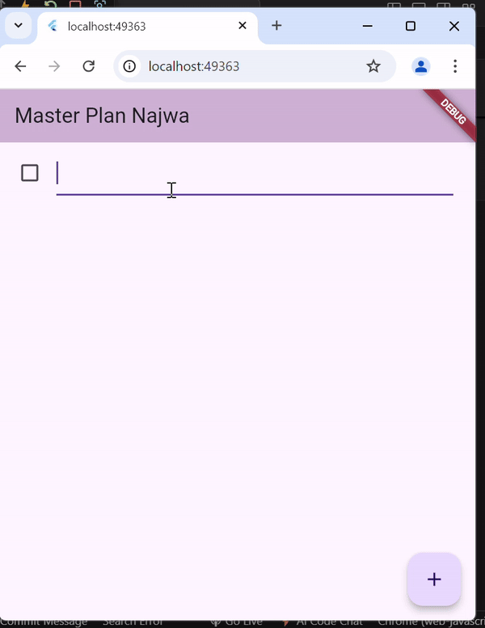
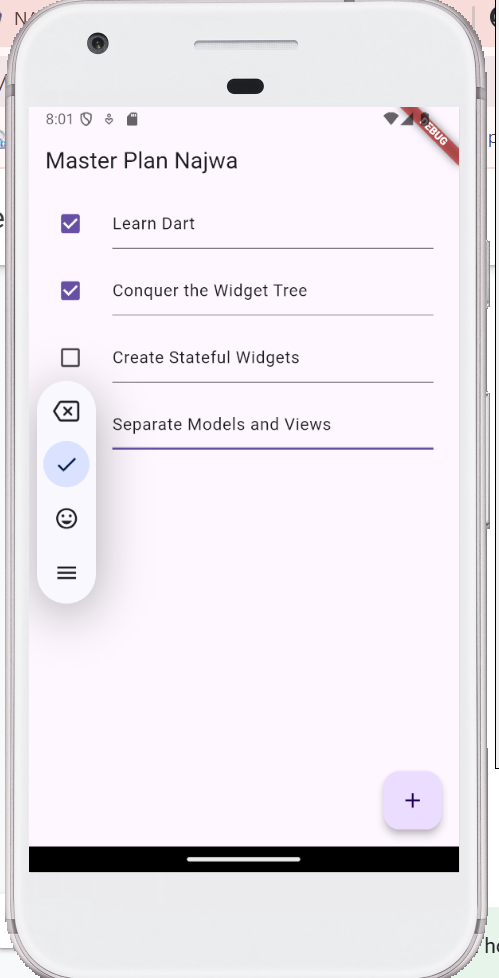

# Laporan Jobsheet 11 Dasar State Management

- **Nama**: Najwa Azzahra
- **Kelas**: TI-3C
- **NIM**: 2241720139

## Praktikum 1: Dasar State dengan Model-View

**plan_screen.dart**

```dart
import '../model/data_layer.dart';
import 'package:flutter/material.dart';

class PlanScreen extends StatefulWidget {
  const PlanScreen({super.key});

  @override
  State createState() => _PlanScreenState();
}

class _PlanScreenState extends State<PlanScreen> {
  Plan plan = const Plan();
  late ScrollController scrollController;

  @override
  void initState() {
    super.initState();
    scrollController = ScrollController()
      ..addListener(() {
        FocusScope.of(context).requestFocus(FocusNode());
      });
  }

  @override
  Widget build(BuildContext context) {
    return Scaffold(
      appBar: AppBar(title: const Text('Master Plan Najwa')),
      body: _buildList(),
      floatingActionButton: _buildAddTaskButton(),
    );
  }

  Widget _buildAddTaskButton() {
    return FloatingActionButton(
      child: const Icon(Icons.add),
      onPressed: () {
        setState(() {
          plan = Plan(
            name: plan.name,
            tasks: List<Task>.from(plan.tasks)..add(const Task()),
          );
        });
      },
    );
  }

  Widget _buildList() {
    return ListView.builder(
      controller: scrollController,
      keyboardDismissBehavior: Theme.of(context).platform == TargetPlatform.iOS
          ? ScrollViewKeyboardDismissBehavior.onDrag
          : ScrollViewKeyboardDismissBehavior.manual,
      itemCount: plan.tasks.length,
      itemBuilder: (context, index) => _buildTaskTile(plan.tasks[index], index),
    );
  }

  Widget _buildTaskTile(Task task, int index) {
    return ListTile(
      leading: Checkbox(
          value: task.complete,
          onChanged: (selected) {
            setState(() {
              plan = Plan(
                name: plan.name,
                tasks: List<Task>.from(plan.tasks)
                  ..[index] = Task(
                    description: task.description,
                    complete: selected ?? false,
                  ),
              );
            });
          }),
      title: TextFormField(
        initialValue: task.description,
        onChanged: (text) {
          setState(() {
            plan = Plan(
              name: plan.name,
              tasks: List<Task>.from(plan.tasks)
                ..[index] = Task(
                  description: text,
                  complete: task.complete,
                ),
            );
          });
        },
      ),
    );
  }

  @override
  void dispose() {
    scrollController.dispose();
    super.dispose();
  }
}
```

**task.dart**

```dart
class Task {
  final String description;
  final bool complete;

  const Task({
    this.complete = false,
    this.description = '',
  });
}
```

**plan.dart**

```dart
import './task.dart';

class Plan {
  final String name;
  final List<Task> tasks;

  const Plan({this.name = '', this.tasks = const []});
}
```

**main.dart**

```dart
import 'package:flutter/material.dart';
import './view/plan_screen.dart';

void main() => runApp(MasterPlanApp());

class MasterPlanApp extends StatelessWidget {
  const MasterPlanApp({super.key});

  @override
  Widget build(BuildContext context) {
    return MaterialApp(
      theme: ThemeData(
          primarySwatch: Colors.purple,
          appBarTheme: AppBarTheme(color: Color.fromARGB(255, 208, 182, 212))),
      home: const PlanScreen(),
    );
  }
}
```

**data_layer.dart**

```dart
export 'plan.dart';
export 'task.dart';
```



### Tugas Praktikum 1

1. Selesaikan langkah-langkah praktikum tersebut, lalu dokumentasikan berupa GIF hasil akhir praktikum beserta penjelasannya di file README.md! Jika Anda menemukan ada yang error atau tidak berjalan dengan baik, silakan diperbaiki.

2. Jelaskan maksud dari langkah 4 pada praktikum tersebut! Mengapa dilakukan demikian?

- Perintah export dalam Dart digunakan untuk membuat API yang lebih bersih dan terstruktur saat mengelola beberapa file dalam proyek. Langkah 4 tersebut digunakan sebagai:
  - Menggabungkan Beberapa File
  - Mengurangi Boilerplate Code
  - Menyediakan API yang Konsisten

3. Mengapa perlu variabel plan di langkah 6 pada praktikum tersebut? Mengapa dibuat konstanta ?

- Variabel plan tersebut berfungsi sebagai model data yang menyimpan informasi terkait rencana dan tugas yang akan dikelola.

4. Lakukan capture hasil dari Langkah 9 berupa GIF, kemudian jelaskan apa yang telah Anda buat!

- 
  Kode program tersebut berfungsi untuk menampilkan daftar tugas, tetapi tidak menangani beberapa aspek pengalaman pengguna yang lebih baik, terutama terkait dengan input teks dan kontrol scrolling.

5. Apa kegunaan method pada Langkah 11 dan 13 dalam lifecyle state ?

- initState(): digunakan untuk inisialisasi dan pengaturan awal, termasuk menambahkan scroll listener untuk mendengarkan event scroll.

- ScrollController dan keyboardDismissBehavior: digunakan untuk mengontrol perilaku scroll dan menangani interaksi keyboard dengan lebih baik, sehingga meningkatkan pengalaman pengguna dalam aplikasi.

6. Kumpulkan laporan praktikum Anda berupa link commit atau repository GitHub ke spreadsheet yang telah disediakan!

## Praktikum 2: Dasar State dengan Model-View
