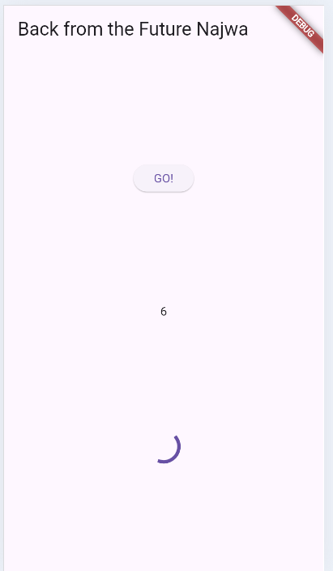
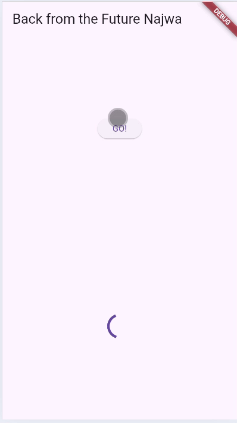
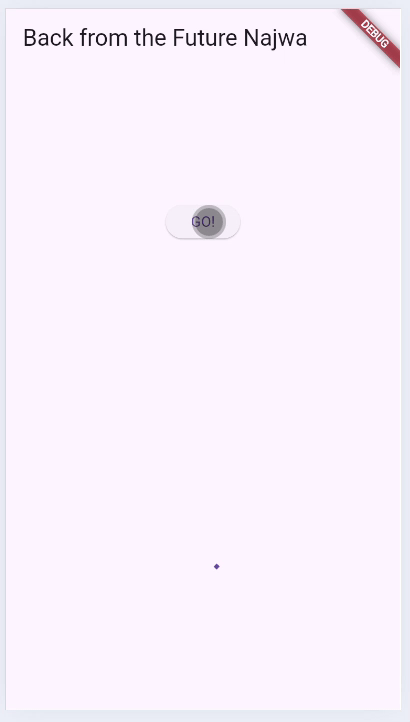
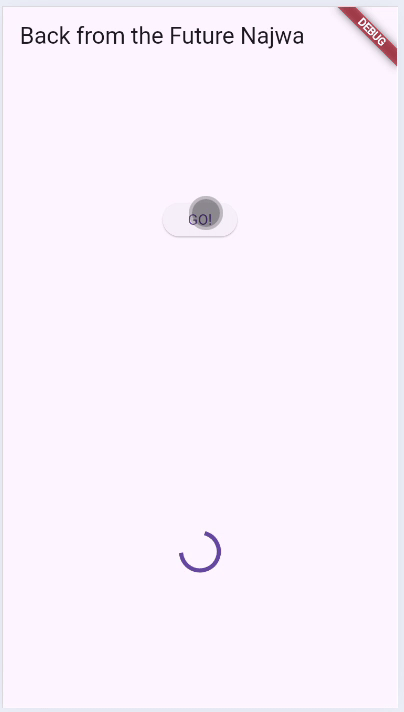
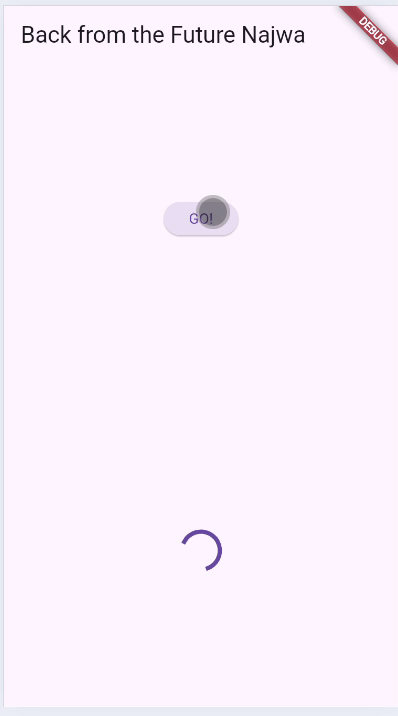
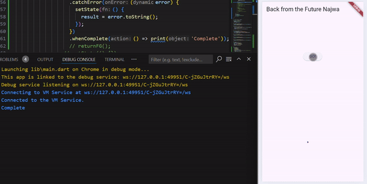
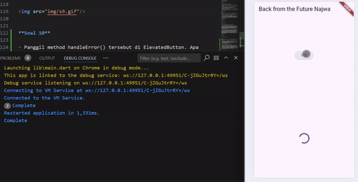
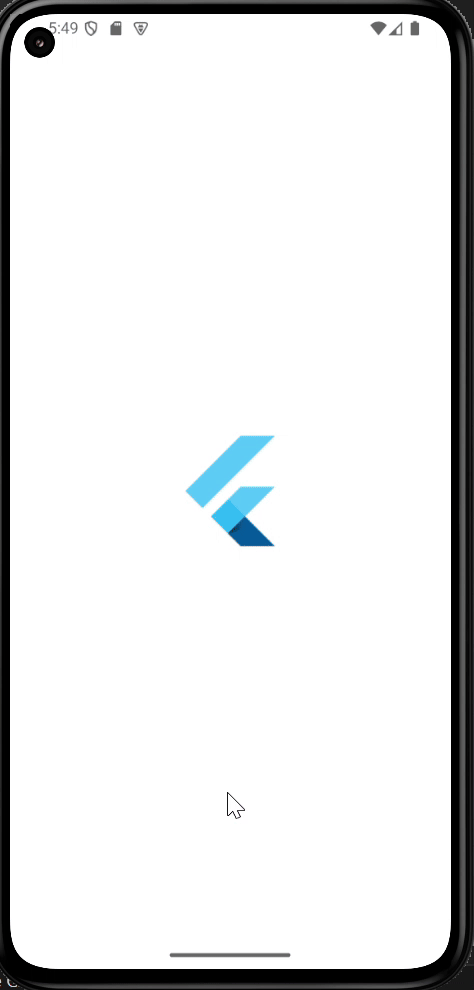
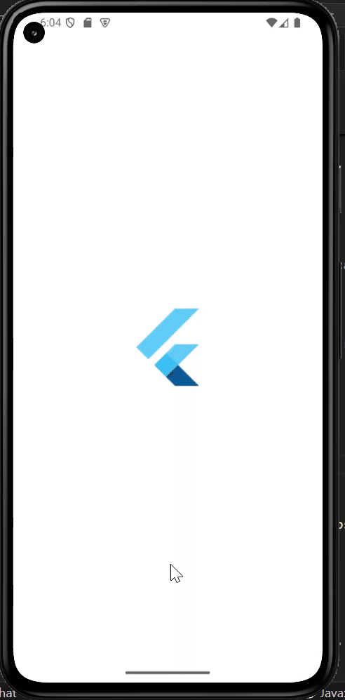
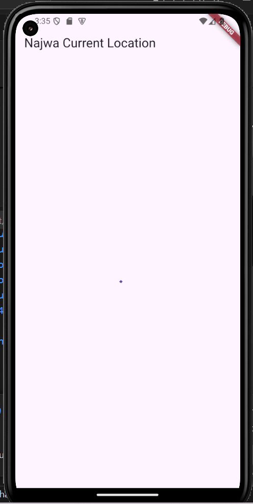

# Laporan Jobsheet 12 Pemrograman Asynchronous

- **Nama**: Najwa Azzahra
- **Kelas**: TI-3C
- **NIM**: 2241720139

## Praktikum 1

**Soal 1**

- Tambahkan nama panggilan Anda pada title app sebagai identitas hasil pekerjaan Anda.

```dart
 @override
  Widget build(BuildContext context) {
    return MaterialApp(
      title: 'Flutter Demo Najwa Azzahra',
      theme: ThemeData(
        primarySwatch: Colors.blue,
        visualDensity: VisualDensity.adaptivePlatformDensity,
      ),
      home: const FuturePage(),
    );
  }
```

**Soal 2**

- Carilah judul buku favorit Anda di Google Books


- lalu ganti ID buku pada variabel path di kode tersebut.

```dart
Future<Response> getData() async {
    const authority = 'www.googleapis.com';
    const path = '/books/v1/volumes/1rW-QpIAs8UC';
    Uri url = Uri.http(authority, path);
    return http.get(url);
  }
```

- Kemudian cobalah akses di browser URI tersebut dengan lengkap seperti ini. Jika menampilkan data JSON, maka Anda telah berhasil.


**Soal 3**

- Jelaskan maksud kode langkah 5 tersebut terkait substring dan catchError!

  - substring(0, 450) digunakan untuk mengambil sebagian kecil dari string yang diterima, membatasi data hingga 450 karakter pertama.

  - catchError digunakan untuk menangani error yang mungkin terjadi saat mengambil atau memproses data, dan jika ada error, menampilkan pesan 'An error occurred' pada variabel result.


## Praktikum 2

**Soal 4**

- Jelaskan maksud kode langkah 1 dan 2 tersebut!

  - Fungsi count() akan menjalankan tiga operasi asinkron secara berurutan, di mana setiap operasi menunggu 3 detik dan mengembalikan nilai yang berbeda (1, 2, dan 3).

  - Nilai yang diperoleh dari ketiga fungsi tersebut dijumlahkan dan hasilnya disimpan dalam variabel result.

  - Fungsi setState() digunakan untuk memperbarui tampilan UI dengan hasil yang baru.

    

## Praktikum 3

**Soal 5**

- Jelaskan maksud kode langkah 2 tersebut!

  - getNumber() dipanggil, yang memulai Completer dan memanggil calculate().

  - calculate() menunggu selama 5 detik (Future.delayed) dan kemudian menyelesaikan Completer dengan nilai 42.

  - getNumber() mengembalikan completer.future, yang akan selesai dengan nilai 42 setelah 5 detik.

  - Nilai tersebut dapat ditunggu di tempat lain menggunakan .then() atau await.



**Soal 6**

- Jelaskan maksud perbedaan kode langkah 2 dengan langkah 5-6 tersebut!

  - catchError pada kode langkah 2 digunakan untuk menangani error dalam Future yang dikembalikan oleh getNumber().

  - try-catch pada kode langkah 5-6 digunakan untuk menangani error dalam fungsi calculate2(), yang memanfaatkan Completer untuk menangani penyelesaian atau kegagalan dari operasi asinkron secara manual.



## Praktikum 4

**Soal 7**



**Soal 8**



- Jelaskan maksud perbedaan kode langkah 1 dan 4!

  - Future.wait: Memproses kumpulan operasi asinkron dengan langsung memberikan daftar Future. Metode ini bawaan dari Dart, sehingga tidak memerlukan pengaturan tambahan. Cocok untuk kasus sederhana di mana kumpulan Future sudah diketahui sejak awal. Dalam penanganan hasil mengembalikan daftar hasil secara langsung, memungkinkan operasi seperti penjumlahan menggunakan fungsi seperti .reduce().

  - FutureGroup: Memanfaatkan library package untuk mengelola Future secara manual. Sehingga perlu menambahkan setiap Future ke dalam grup secara eksplisit dan menutup grup sebelum memproses hasilnya. Berguna untuk skenario lebih kompleks, seperti menambahkan Future secara dinamis selama runtime sebelum grup ditutup. Mengembalikan daftar hasil setelah grup ditutup, tetapi memerlukan penanganan manual untuk mengolah data, seperti menggunakan loop.


## Praktikum 5

**Soal 9**




**Soal 10**

- Panggil method handleError() tersebut di ElevatedButton. Apa hasilnya? 

  - Method handleError menggunakan blok try-catch-finally untuk menangani error yang dilempar oleh returnError().
  - Jika returnError() melempar error (setelah delay 2 detik), blok catch akan menangkap error tersebut.
  - lok finally akan selalu dijalankan setelah try atau catch, mencetak pesan 'Complete'.

- Jelaskan perbedaan kode langkah 1 dan 4!

  - Pada langkah 1 penanganan error menggunakan chaining .then(), .catchError(), dan .whenComplete(), sehingga error ditangani langsung di dalam method .catchError() tanpa menulis kode tambahan
  - Pada langkah 4 penanganan error menggunakan blok try-catch-finally, sehingga error ditangani di dalam blok catch di method handleError yang memungkinkan fleksibilitas lebih besar untuk penanganan logika tambahan jika diperlukan




## Praktikum 6

**Soal 11**

- Tambahkan nama panggilan Anda pada tiap properti title sebagai identitas pekerjaan Anda.

```dart
@override
  Widget build(BuildContext context) {
    return Scaffold(
      appBar: AppBar(title: const Text('Najwa Current Location')),
      body: Center(child: Text(myPosition)),
    );
  }
```




**Soal 12**

- Apakah Anda mendapatkan koordinat GPS ketika run di browser? Mengapa demikian?

    - Iya, karena menggunakan library geolocator untuk mengakses informasi lokasi perangkat. 
    Pada kode program yang dituliskan:
      - Memastikan izin lokasi diberikan (Geolocator.requestPermission()).
      - Memeriksa apakah layanan lokasi aktif (Geolocator.isLocationServiceEnabled()).
      - Mengambil lokasi perangkat dengan Geolocator.getCurrentPosition().




## Praktikum 7

**Soal 13**
- Apakah ada perbedaan UI dengan praktikum sebelumnya? Mengapa demikian?

    - Tidak ada perbedaan UI, dikarenakan perbedaan terletak pada kode program yang dijalankan untuk menjalankan lokasi, pada kode program pertama, data harus ditangani dengan manual dengan setState sedangkan kode program kedua dijalankan dari futureBuilder

    

**Soal 14**

- Apakah ada perbedaan UI dengan langkah sebelumnya? Mengapa demikian?
  
  - Tidak ada perbedaan tampilan UI karena kode program yang baru ditambahkan berfungsi untuk menampilkan pesan error di UI ketika future gagal dijalankan, sedangkan pada percobaan yang dilakukan, tidak ada kondisi error

  

