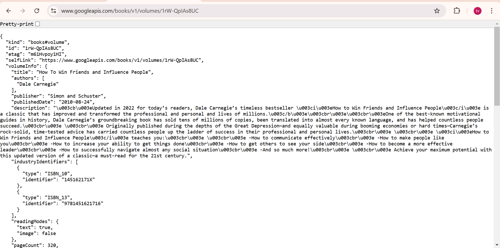
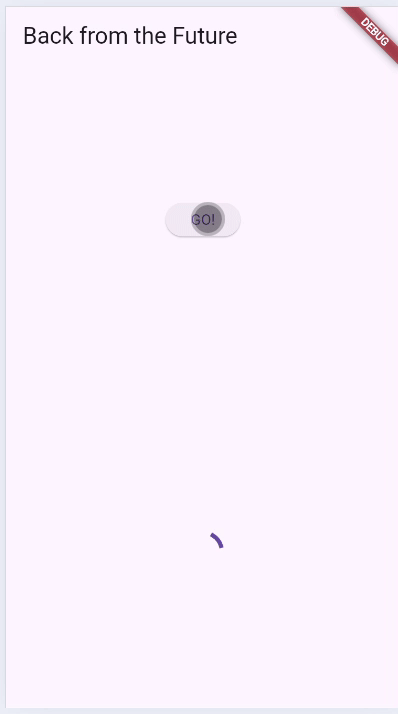

# Laporan Jobsheet 12 Pemrograman Asynchronous

- **Nama**: Najwa Azzahra
- **Kelas**: TI-3C
- **NIM**: 2241720139

## Praktikum 1

**Soal 1**

- Tambahkan nama panggilan Anda pada title app sebagai identitas hasil pekerjaan Anda.

```dart
 @override
  Widget build(BuildContext context) {
    return MaterialApp(
      title: 'Flutter Demo Najwa Azzahra',
      theme: ThemeData(
        primarySwatch: Colors.blue,
        visualDensity: VisualDensity.adaptivePlatformDensity,
      ),
      home: const FuturePage(),
    );
  }
```

**Soal 2**

- Carilah judul buku favorit Anda di Google Books


- lalu ganti ID buku pada variabel path di kode tersebut. 

```dart
Future<Response> getData() async {
    const authority = 'www.googleapis.com';
    const path = '/books/v1/volumes/1rW-QpIAs8UC';
    Uri url = Uri.http(authority, path);
    return http.get(url);
  }
```

- Kemudian cobalah akses di browser URI tersebut dengan lengkap seperti ini. Jika menampilkan data JSON, maka Anda telah berhasil. 



**Soal 3**

- Jelaskan maksud kode langkah 5 tersebut terkait substring dan catchError!

    - substring(0, 450) digunakan untuk mengambil sebagian kecil dari string yang diterima, membatasi data hingga 450 karakter pertama.
    
    - catchError digunakan untuk menangani error yang mungkin terjadi saat mengambil atau memproses data, dan jika ada error, menampilkan pesan 'An error occurred' pada variabel result.



**Soal 4**

- Jelaskan maksud kode langkah 1 dan 2 tersebut!

    - Fungsi count() akan menjalankan tiga operasi asinkron secara berurutan, di mana setiap operasi menunggu 3 detik dan mengembalikan nilai yang berbeda (1, 2, dan 3).

    - Nilai yang diperoleh dari ketiga fungsi tersebut dijumlahkan dan hasilnya disimpan dalam variabel result.
    
    - Fungsi setState() digunakan untuk memperbarui tampilan UI dengan hasil yang baru.