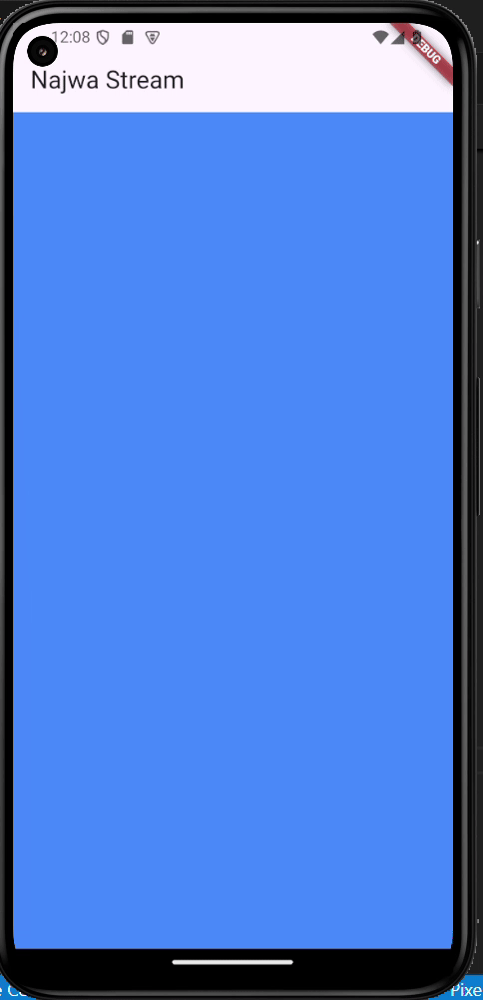
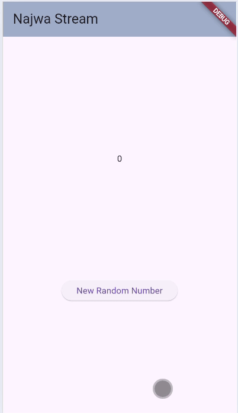
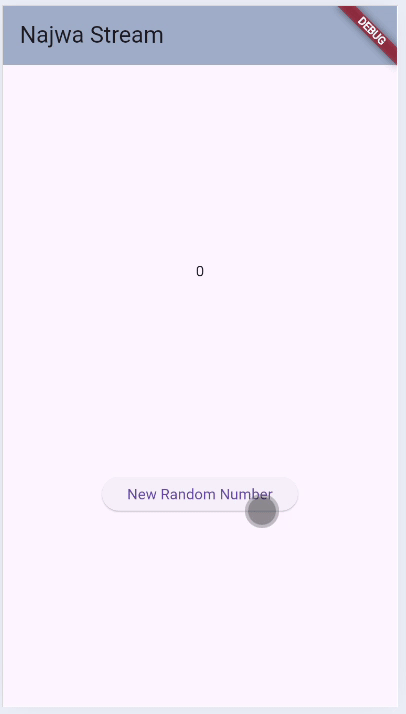
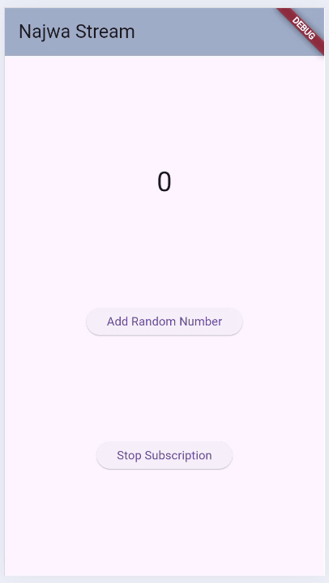
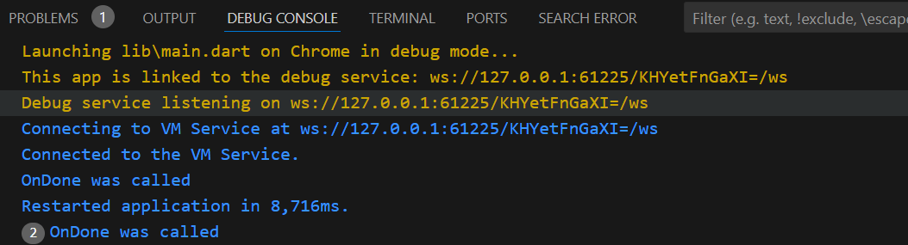
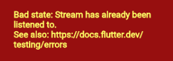
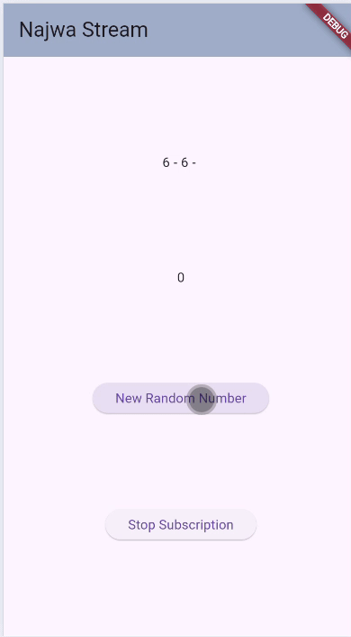
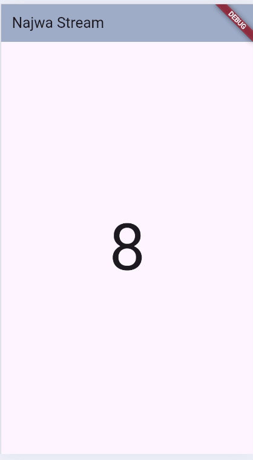
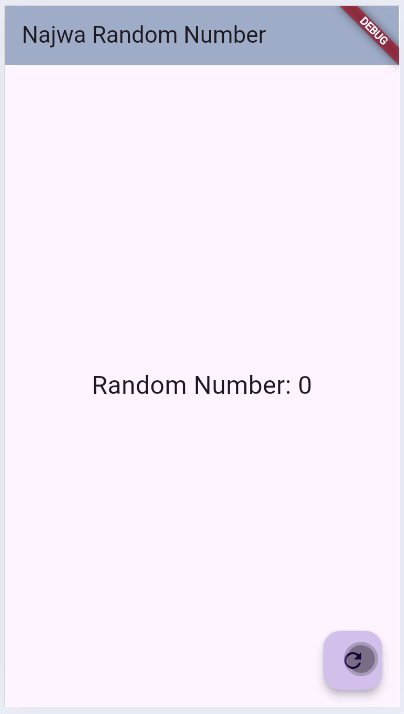

# Laporan Jobsheet 12 BLoC

- **Nama**: Najwa Azzahra
- **Kelas**: TI-3C
- **NIM**: 2241720139


**Soal 1**

- Tambahkan nama panggilan Anda pada title app sebagai identitas hasil pekerjaan Anda dan gantilah warna tema aplikasi sesuai kesukaan Anda.

```dart
@override
  Widget build(BuildContext context) {
    return MaterialApp(
      title: 'Najwa Stream',
      theme: ThemeData(
        primaryColor: Colors.red.shade200,
      ),
      home: const StreamHomePage(),
    );
  }
```

**Soal 2**

- Tambahkan 5 warna lainnya sesuai keinginan Anda pada variabel colors tersebut.

class ColorStream {
  final List<Color> colors = [
    Colors.blueGrey,
    Colors.amber,
    Colors.deepPurple,
    Colors.lightBlue,
    Colors.teal,

    //soal 2
    Colors.purpleAccent,
    Colors.limeAccent,
    Colors.pinkAccent,
    Colors.deepOrange,
    Colors.greenAccent,
    Colors.blueAccent,
  ];
}

**Soal 3**

- Jelaskan fungsi keyword yield* pada kode tersebut!

    - yield* digunakan dalam generator function untuk menghasilkan semua elemen secara berurutan tanpa menuliskan loop manual.

- Apa maksud isi perintah kode tersebut?

    - Kode tersebut menghasilkan semua elemen dari list yang telah diinisialisasi sebelum

        - Saat getColors() dipanggil, ia memulai sebuah async generator function.

        - Stream.periodic menghasilkan warna berdasarkan waktu yang dihitung setiap detik.

        - Setiap warna yang dihasilkan oleh Stream.periodic diteruskan ke output getColors() menggunakan yield*.

**Soal 4**


**Soal 5**



- Jelaskan perbedaan menggunakan listen dan await for

    - Pada listen setiap kali ada data baru yang dihasilkan oleh stream, callback yang diberikan ke listen akan dipanggil. Listen cocok untuk pemrosesan reaktif dimana aplikasi terus merespons data baru.
    Sedangkan pada await for digunakan untuk mengiterasi elemen dalam stream, seperti for loop pada koleksi biasa. Namun, alur eksekusi akan tertahan hingga semua elemen dalam stream selesai diolah, sehingga await for cocok digunakan untuk alur sekuensial

**Soal 6**



- Jelaskan maksud kode langkah 8 dan 10 tersebut!

    - Pada initState(), stream dan controller diinisialisasi.
    - Listener didaftarkan ke stream untuk memproses event baru dan mengubah nilai lastNumber saat data diterima.
    - Ketika addRandomNumber() dipanggil, angka acak dihasilkan dan ditambahkan ke sink milik numberStreamController.
    - Data yang masuk ke sink langsung mengalir ke stream.
    - Listener pada stream menangkap data ini, memprosesnya, dan memperbarui UI melalui setState().

**Soal 7**

- Jelaskan maksud kode langkah 13 sampai 15 tersebut!

    - controller.addError('Error')
        
        Fungsi addError pada stream controller digunakan untuk mem-push sebuah error ke dalam stream. Dalam hal ini, string 'Error' akan diproses sebagai error. Setelah error ini ditambahkan ke stream, stream akan men-trigger callback onError yang sudah  ditentukan sebelumnya dalam stream.listen.

    - onError
        
        Ketika stream menerima error (seperti yang dipicu dengan addError), callback onError akan dijalankan. Dalam hal ini, error ditangani dengan mengganti nilai lastNumber menjadi -1 (menandakan bahwa ada error yang terjadi).

    - addRandomNumber()
        
        Fungsi ini semula mungkin digunakan untuk menambahkan angka acak ke dalam stream, tetapi saat ini yang dipanggil yaitu numberStream.addError() di dalamnya. Ini berarti bahwa ketika fungsi ini dipanggil, stream akan menerima error ('Error'), yang kemudian akan memicu callback onError.

**Soal 8**



- Jelaskan maksud kode langkah 1-3 tersebut!

    - langkah 1: inisialisasi StreamTransformer yang bertugas memproses data dari stream
    - langkah 2: memberikan value untuk data yang akan ditampilkan 
        - handleData: Mengalikan data dengan 10 sebelum diteruskan ke stream berikutnya.
        - handleError: Jika terjadi error, mengirim nilai -1 sebagai fallback.
        - handleDone: Menutup stream ketika selesai. 
    - langkah 3: mendaftarkan listener untuk memproses event baru dari stream.
        - onData (event): Ketika ada data baru, nilai lastNumber diperbarui dengan data tersebut.
        - onError: Jika terjadi error, nilai lastNumber diset menjadi -1.

**Soal 9**





- Jelaskan maksud kode langkah 2, 6 dan 8 tersebut!

    - langkah 2: mengatur stream dan mendengarkan (listen) data dari stream menggunakan StreamSubscription

    - langkah 6:  menghentikan langganan (subscription) pada stream. Dengan memanggil subscription.cancel(), aplikasi akan berhenti mendengarkan data dari stream.

    - langkah 8: Fungsi addRandomNumber() digunakan untuk menambahkan data baru ke stream menggunakan sink dari numberStreamController.

**Soal 10**



- Jelaskan mengapa error itu bisa terjadi?

    - Kesalahan "Bad state: Stream has already been listened to" terjadi karena sebuah stream bertipe single-subscription (default) mencoba didengarkan (listened) lebih dari sekali. Secara bawaan, StreamController di Dart menghasilkan single-subscription stream, yang berarti hanya satu listener yang dapat berlangganan ke stream tersebut. Ketika Anda mencoba menambahkan lebih dari satu listener ke stream yang sama, kesalahan ini muncul.

**Soal 11**



- Jelaskan mengapa hal itu bisa terjadi ?

    - Halaman utama StreamHomePage ditampilkan.
    - Stream dibuat dan listener aktif untuk memantau data yang dikirim.
    - Fungsi addRandomNumber() menghasilkan angka acak dan mengirimkan angka tersebut ke stream.
    - Listener menerima angka tersebut dan memperbarui teks di UI.
    - Fungsi stopStream() dipanggil untuk menutup stream.
    - Setelah ini, stream tidak dapat mengirimkan data lagi. Jika addRandomNumber() dipanggil, error -1 akan ditampilkan.
    - Jika terjadi error dalam stream, teks angka terakhir akan diubah menjadi -1.

**Soal 12**



- Jelaskan maksud kode pada langkah 3 dan 7 !

  - Langkah 3: Membuat aliran data (stream) berupa angka acak antara 0 dan 9 yang diperbarui setiap detik.
  - Langkah 7: Memperbarui UI berdasarkan data dari NumberStream secara real-time.

**Soal 13**



- Jelaskan maksud praktikum ini ! Dimanakah letak konsep pola BLoC-nya ?

  - Konsep pola BLoC pada praktikum ini adalah:

      - Event-driven dengan menggunakan StreamController untuk menangani input (perintah untuk menghasilkan angka acak) dan output (angka acak yang dihasilkan).
      - Stream digunakan untuk menghubungkan antara BLoC dan UI, memastikan pemisahan yang jelas antara keduanya.
      - Pemisahan logika bisnis dan UI yang memudahkan pemeliharaan dan pengembangan aplikasi.