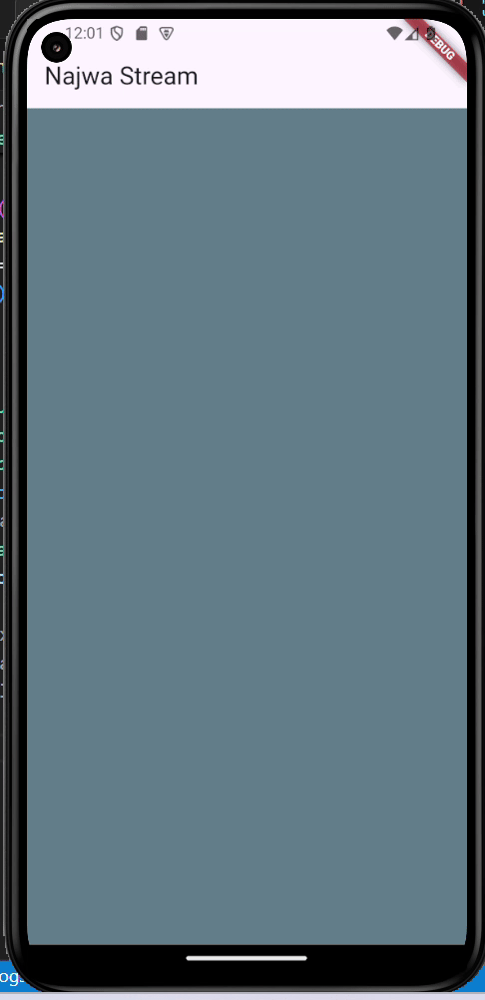

# Laporan Jobsheet 12 BLoC

- **Nama**: Najwa Azzahra
- **Kelas**: TI-3C
- **NIM**: 2241720139

## Praktikum 1

**Soal 1**

- Tambahkan nama panggilan Anda pada title app sebagai identitas hasil pekerjaan Anda dan gantilah warna tema aplikasi sesuai kesukaan Anda.

```dart
@override
  Widget build(BuildContext context) {
    return MaterialApp(
      title: 'Najwa Stream',
      theme: ThemeData(
        primaryColor: Colors.red.shade200,
      ),
      home: const StreamHomePage(),
    );
  }
```

**Soal 2**

- Tambahkan 5 warna lainnya sesuai keinginan Anda pada variabel colors tersebut.

class ColorStream {
  final List<Color> colors = [
    Colors.blueGrey,
    Colors.amber,
    Colors.deepPurple,
    Colors.lightBlue,
    Colors.teal,

    //soal 2
    Colors.purpleAccent,
    Colors.limeAccent,
    Colors.pinkAccent,
    Colors.deepOrange,
    Colors.greenAccent,
    Colors.blueAccent,
  ];
}

**Soal 3**

- Jelaskan fungsi keyword yield* pada kode tersebut!

    - yield* digunakan dalam generator function untuk menghasilkan semua elemen secara berurutan tanpa menuliskan loop manual.

- Apa maksud isi perintah kode tersebut?

    - Kode tersebut menghasilkan semua elemen dari list yang telah diinisialisasi sebelum

        - Saat getColors() dipanggil, ia memulai sebuah async generator function.

        - Stream.periodic menghasilkan warna berdasarkan waktu yang dihitung setiap detik.

        - Setiap warna yang dihasilkan oleh Stream.periodic diteruskan ke output getColors() menggunakan yield*.

**Soal 4**

