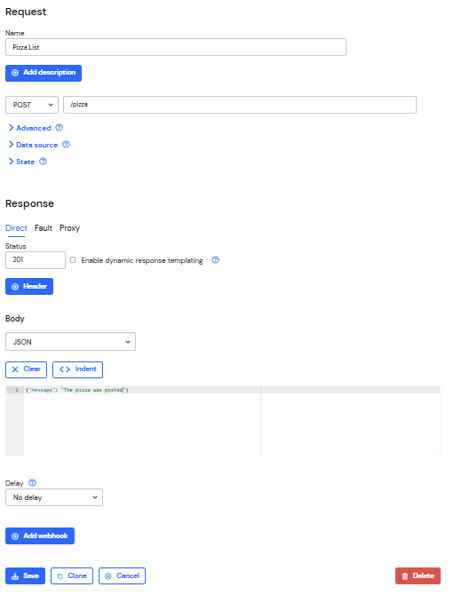
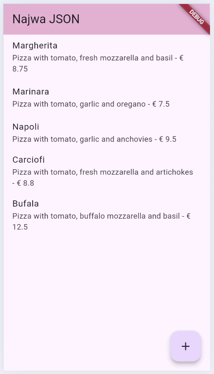

# LAPORAN JOBSHEET 13 RESTFUL API

- **Nama**: Najwa Azzahra
- **Kelas**: TI-3C
- **NIM**: 2241720139

## Praktikum 1: Designing an HTTP client and getting data

1.  Mendaftarlah ke layanan Lab Mock di https://app.wiremock.cloud/. Bisa anda gunakan akun google untuk mendaftar. Jika berhasil bendaftar dan login, akan muncul seperti gambar berikut.


2. Di halaman dahsboard, klik menu Stubs, kemudian klik entri pertama yaitu “GET a JSON 
resource”. Anda akan melihat layar yang mirip dengan berikut


3. Klik “Create new stub”. Di kolom sebelah kanan, lengkapi data berikut. Namanya adalah “Pizza List”, kemudian pilih GET dan isi dengan “/pizzalist”. Kemudian, pada bagian Response, untuk status 200, kemudian pada Body pilih JSON sebagai formatnya dan isi konten JSON dari https://bit.ly/pizzalist. Perhatikan gambar berikut.


4. Tekan tombol SAVE di bagian bawah halaman untuk menyimpan Mock ini. Jika berhasil 
tersimpan, maka Mock API sudah siap digunakan.


5. Buatlah project flutter baru dengan nama pizza_api_nama_anda, tambahkan depedensi 
“http” melalui terminal.


6. DI folder “lib” project anda, tambahkan file dengan nama “httphelper.dart”.


7. Isi httphelper.dart dengan kode berikut. Ubah “02z2g.mocklab.io” dengan URL Mock API anda.

```dart
import 'dart:convert';
import 'package:http/http.dart' as http;
import 'pizza.dart';

class HttpHelper {
  final String authority = '42rmy.wiremockapi.cloud';
  final String path = '/pizzalist';

  Future<List<Pizza>> getPizzaList() async {
    // Construct the full URL
    final Uri url = Uri.https(authority, path);
    // Make the GET request
    final http.Response result = await http.get(url);

    // Check the status code
    if (result.statusCode == 200) {
      // Parse the response body
      final jsonResponse = jsonDecode(result.body);
      List<Pizza> pizzas = (jsonResponse as List<dynamic>)
          .map<Pizza>((item) => Pizza.fromJson(item))
          .toList();
      return pizzas;
    } else {
      // Return an empty list if the request fails
      return [];
    }
  }
}

```

8. Di file “main.dart”, di class _ MyHomePageState, tambahkan metode bernama “callPizzas”. Metode ini mengembalikan sebuah Future dari daftar objek Pizza dengan memanggil metode getPizzaList dari kelas HttpHelper, dengan kode sebagai berikut:


```dart
  Future<List<Pizza>> callPizzas() async {
    HttpHelper helper = HttpHelper();
    List<Pizza> pizzas = await helper.getPizzaList();
    return pizzas;
  }
```
9.  Pada metode build di class _MyHomePageState, di dalam body Scaffold, tambahkan FutureBuilder yang membuat ListView dari widget ListTile yang berisi objek Pizza:

```dart
  @override
Widget build(BuildContext context) {
  return Scaffold(
    appBar: AppBar(
      backgroundColor: const Color.fromARGB(255, 231, 185, 212),
      title: const Text('Najwa JSON'),
    ),
    body: FutureBuilder<List<Pizza>>(
      future: callPizzas(),
      builder: (BuildContext context, AsyncSnapshot<List<Pizza>> snapshot) {
        if (snapshot.connectionState == ConnectionState.waiting) {
          return const Center(child: CircularProgressIndicator());
        } else if (snapshot.hasError) {
          return const Center(child: Text('Something went wrong'));
        } else if (!snapshot.hasData || snapshot.data!.isEmpty) {
          return const Center(child: Text('No data available'));
        }
        
        return ListView.builder(
          itemCount: snapshot.data!.length,
          itemBuilder: (BuildContext context, int position) {
            return ListTile(
              title: Text(snapshot.data![position].pizzaName),
              subtitle: Text(
                '${snapshot.data![position].description} - € ${snapshot.data![position].price}'
              ),
            );
          },
        );
      },
    ),
  );
}
```

10.  Jalankan aplikasi. Anda akan melihat layar yang mirip dengan berikut ini:


## Praktikum 2: POST-ing data

1.  Masuk ke layanan Lab Mock di https://app.wiremock.cloud/ dan klik bagian Stubs, 
kemudian, buatlah stub baru


2.  Lengkapi isian seperti gambar berikut:

 

3. Simpan.

4. Di proyek Flutter, di file httpHelper.dart, di kelas HttpHelper, buat metode baru bernama postPizza, lengkapi kode sebagai berikut

```dart
Future<String> postPizza(Pizza pizza) async {
    const postPath = '/pizza';
    String post = json.encode(pizza.toJson());
    Uri url = Uri.https(authority, postPath);
    http.Response r = await http.post(
      url,
      body: post,
    );
    return r.body;
  }
```

5. Di dalam proyek, buat sebuah file baru bernama pizza_detail.dart.

6. Di bagian atas file baru, tambahkan impor yang diperlukan.

```dart
import 'package:flutter/material.dart';
import 'httphelper.dart';
import 'pizza.dart';
```

7. Buat StatefulWidget bernama PizzaDetailScreen

```dart
class PizzaDetailScreen extends StatefulWidget {
  const PizzaDetailScreen({super.key});

  @override
  State<PizzaDetailScreen> createState() => _PizzaDetailScreenState();
}

class _PizzaDetailScreenState extends State<PizzaDetailScreen> {
  
  @override
  Widget build(BuildContext context) {
    return Placeholder();
  }
}
```

8. Di bagian atas kelas _PizzaDetailScreenState, tambahkan lima widget TextEditingController. Widget ini akan berisi data untuk objek Pizza yang akan diposting nanti. Juga, tambahkan sebuah String yang akan berisi hasil dari permintaan POST.

``` dart
  final TextEditingController txtId = TextEditingController();
  final TextEditingController txtName = TextEditingController();
  final TextEditingController txtDescription = TextEditingController();
  final TextEditingController txtPrice = TextEditingController();
  final TextEditingController txtImageUrl = TextEditingController();
  String operationResult = '';
```

9. Override metode dispose() untuk membuang controllers

```dart
@override
  void dispose() {
    txtId.dispose();
    txtName.dispose();
    txtDescription.dispose();
    txtPrice.dispose();
    txtImageUrl.dispose();
    super.dispose();
  }
```

10. Dalam metode build() pada kelas, kita return sebuah Scaffold, yang AppBar-nya berisi Teks yang menyatakan “Detail Pizza” dan Body-nya berisi Padding dan SingleChildScrollView yang berisi Column.

11.  Untuk properti anak dari Column, tambahkan beberapa Text yang akan berisi hasil posting, lima TextFields, masing-masing terikat pada TextEditingController, dan sebuah ElevatedButton untuk menyelesaikan aksi POST (metode postPizza akan dibuat berikutnya). Juga, tambahkan SizedBox untuk memberi jarak pada widget di layar

```dart
@override
  Widget build(BuildContext context) {
    return Scaffold(
      appBar: AppBar(
        title: const Text('Najwa Pizza Detail'),
        backgroundColor: const Color.fromARGB(255, 231, 185, 212),
      ),
      body: Padding(
        padding: const EdgeInsets.all(12),
        child: SingleChildScrollView(
          child: Column(
            crossAxisAlignment: CrossAxisAlignment.start,
            children: [
              Text(
                operationResult,
                style: TextStyle(
                  backgroundColor: Colors.green.shade200,
                  color: Colors.black,
                  fontSize: 16,
                ),
              ),
              const SizedBox(height: 24),
              TextField(
                controller: txtId,
                decoration: const InputDecoration(hintText: 'Insert ID'),
                keyboardType: TextInputType.number,
              ),
              const SizedBox(height: 24),
              TextField(
                controller: txtName,
                decoration:
                    const InputDecoration(hintText: 'Insert Pizza Name'),
              ),
              const SizedBox(height: 24),
              TextField(
                controller: txtDescription,
                decoration:
                    const InputDecoration(hintText: 'Insert Description'),
              ),
              const SizedBox(height: 24),
              TextField(
                controller: txtPrice,
                decoration: const InputDecoration(hintText: 'Insert Price'),
                keyboardType: TextInputType.number,
              ),
              const SizedBox(height: 24),
              TextField(
                controller: txtImageUrl,
                decoration: const InputDecoration(hintText: 'Insert Image Url'),
              ),
              const SizedBox(height: 48),
              ElevatedButton(
                child: const Text('Send Post'),
                onPressed: postPizza,
              ),
            ],
          ),
        ),
      ),
    );
  }
```

12. Di bagian bawah kelas _PizzaDetailState, tambahkan metode postPizza.
```dart
Future postPizza() async {
    HttpHelper helper = HttpHelper();
    Pizza pizza = Pizza(
      id: int.tryParse(txtId.text) ?? 0,
      pizzaName: txtName.text,
      description: txtDescription.text,
      price: double.tryParse(txtPrice.text) ?? 0.0,
      imageUrl: txtImageUrl.text,
    );

    String result = await helper.postPizza(pizza);
    setState(() {
      operationResult = result;
    });
  }
```

13. Di file main.dart, impor file pizza_detail.dart.
14. Di perancah metode build() dari kelas _MyHomePageState, tambahkan FloatingActionButton yang akan menavigasi ke rute PizzaDetail.
```dart
floatingActionButton: FloatingActionButton(
        child: const Icon(Icons.add),
        onPressed: () {
          Navigator.push(
            context,
            MaterialPageRoute(builder: (context) => const PizzaDetailScreen()),
          );
        },
      ),
```
15. Jalankan aplikasi. Pada layar utama, tekan FloatingActionButton untuk menavigasi ke rute PizzaDetail
16. Tambahkan detail pizza di kolom teks dan tekan tombol Kirim Postingan. Anda akan 
melihat hasil yang berhasil, seperti yang ditunjukkan pada gambar berikut.
 

## Praktikum 3: Praktikum 3, PUT-ting data

1.  Mendaftarlah ke layanan Lab Mock di https://app.wiremock.cloud/. Bisa anda gunakan akun google untuk mendaftar. Jika berhasil bendaftar dan login, akan muncul seperti gambar berikut.


2. 

3.

4.

5.

6.
7.
8.
9.
10.
11.
12.
13.
14.
15.
16.

## Praktikum 4: Praktikum 4, DELETE-ing data

1. Masuk ke layanan Wiremock


2. 

3.

4.

5.

6.
7.
8.
9.
10.
11.
12.
13.
14.
15.
16.