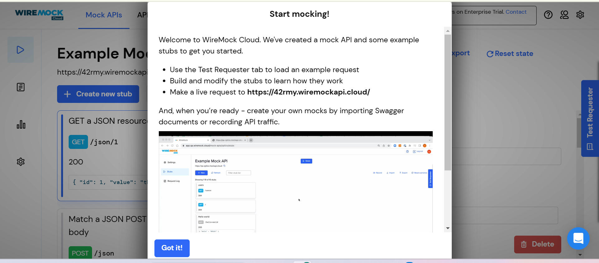
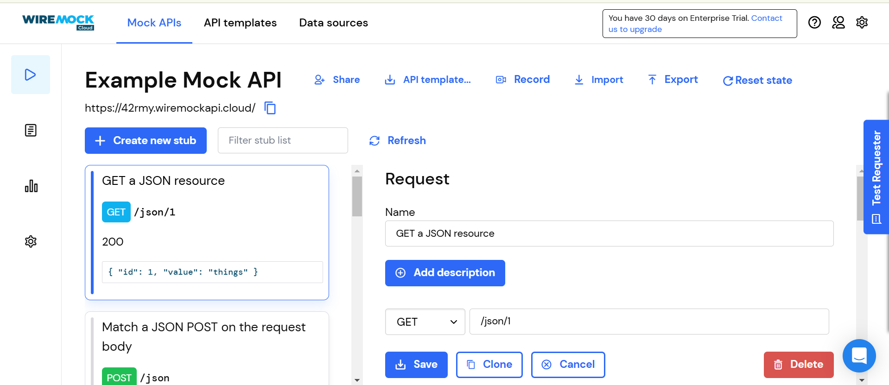
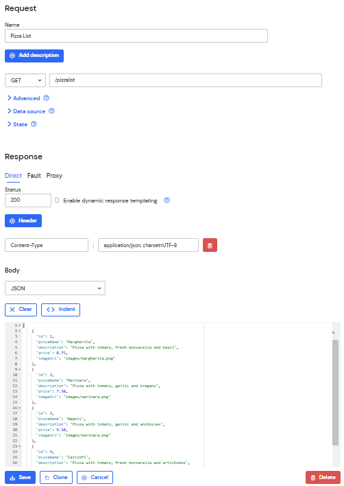
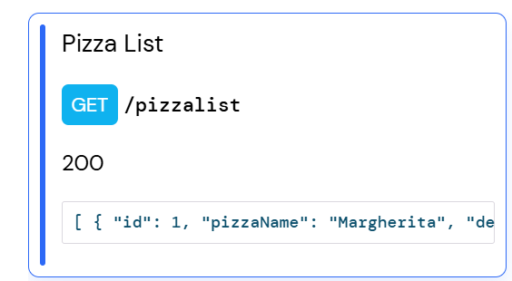
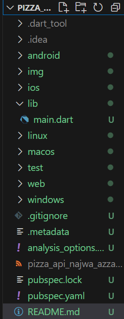
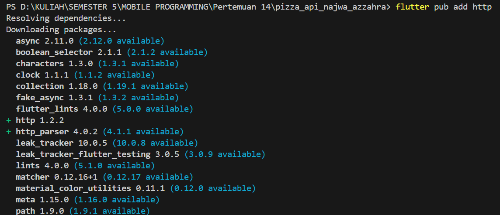
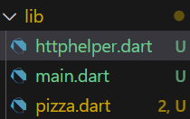
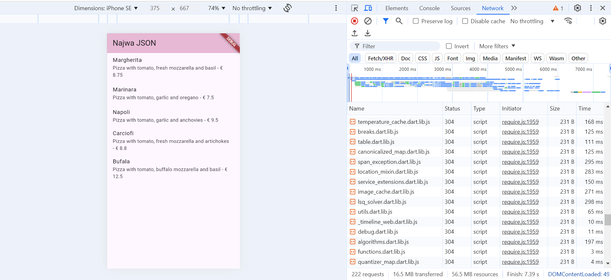

# LAPORAN JOBSHEET 13 RESTFUL API

- **Nama**: Najwa Azzahra
- **Kelas**: TI-3C
- **NIM**: 2241720139

## Praktikum 1: Designing an HTTP client and getting data

1.  Mendaftarlah ke layanan Lab Mock di https://app.wiremock.cloud/. Bisa anda gunakan akun google untuk mendaftar. Jika berhasil bendaftar dan login, akan muncul seperti gambar berikut.



2. Di halaman dahsboard, klik menu Stubs, kemudian klik entri pertama yaitu “GET a JSON 
resource”. Anda akan melihat layar yang mirip dengan berikut



3. Klik “Create new stub”. Di kolom sebelah kanan, lengkapi data berikut. Namanya adalah “Pizza List”, kemudian pilih GET dan isi dengan “/pizzalist”. Kemudian, pada bagian Response, untuk status 200, kemudian pada Body pilih JSON sebagai formatnya dan isi konten JSON dari https://bit.ly/pizzalist. Perhatikan gambar berikut.



4. Tekan tombol SAVE di bagian bawah halaman untuk menyimpan Mock ini. Jika berhasil 
tersimpan, maka Mock API sudah siap digunakan.



5. Buatlah project flutter baru dengan nama pizza_api_nama_anda, tambahkan depedensi 
“http” melalui terminal.




6. DI folder “lib” project anda, tambahkan file dengan nama “httphelper.dart”.



7. Isi httphelper.dart dengan kode berikut. Ubah “02z2g.mocklab.io” dengan URL Mock API anda.

```dart
import 'dart:convert';
import 'package:http/http.dart' as http;
import 'pizza.dart';

class HttpHelper {
  final String authority = '42rmy.wiremockapi.cloud';
  final String path = '/pizzalist';

  Future<List<Pizza>> getPizzaList() async {
    // Construct the full URL
    final Uri url = Uri.https(authority, path);
    // Make the GET request
    final http.Response result = await http.get(url);

    // Check the status code
    if (result.statusCode == 200) {
      // Parse the response body
      final jsonResponse = jsonDecode(result.body);
      List<Pizza> pizzas = (jsonResponse as List<dynamic>)
          .map<Pizza>((item) => Pizza.fromJson(item))
          .toList();
      return pizzas;
    } else {
      // Return an empty list if the request fails
      return [];
    }
  }
}

```

8. Di file “main.dart”, di class _ MyHomePageState, tambahkan metode bernama “callPizzas”. Metode ini mengembalikan sebuah Future dari daftar objek Pizza dengan memanggil metode getPizzaList dari kelas HttpHelper, dengan kode sebagai berikut:


```dart
  Future<List<Pizza>> callPizzas() async {
    HttpHelper helper = HttpHelper();
    List<Pizza> pizzas = await helper.getPizzaList();
    return pizzas;
  }
```
9.  Pada metode build di class _MyHomePageState, di dalam body Scaffold, tambahkan FutureBuilder yang membuat ListView dari widget ListTile yang berisi objek Pizza:

```dart
  @override
Widget build(BuildContext context) {
  return Scaffold(
    appBar: AppBar(
      backgroundColor: const Color.fromARGB(255, 231, 185, 212),
      title: const Text('Najwa JSON'),
    ),
    body: FutureBuilder<List<Pizza>>(
      future: callPizzas(),
      builder: (BuildContext context, AsyncSnapshot<List<Pizza>> snapshot) {
        if (snapshot.connectionState == ConnectionState.waiting) {
          return const Center(child: CircularProgressIndicator());
        } else if (snapshot.hasError) {
          return const Center(child: Text('Something went wrong'));
        } else if (!snapshot.hasData || snapshot.data!.isEmpty) {
          return const Center(child: Text('No data available'));
        }
        
        return ListView.builder(
          itemCount: snapshot.data!.length,
          itemBuilder: (BuildContext context, int position) {
            return ListTile(
              title: Text(snapshot.data![position].pizzaName),
              subtitle: Text(
                '${snapshot.data![position].description} - € ${snapshot.data![position].price}'
              ),
            );
          },
        );
      },
    ),
  );
}
```

10.  Jalankan aplikasi. Anda akan melihat layar yang mirip dengan berikut ini:




## Praktikum 2: POST-ing data

1.  Mendaftarlah ke layanan Lab Mock di https://app.wiremock.cloud/. Bisa anda gunakan akun google untuk mendaftar. Jika berhasil bendaftar dan login, akan muncul seperti gambar berikut.


2. 

3.

4.

5.

6.
7.
8.
9.
10.
11.
12.
13.
14.
15.
16.

## Praktikum 3: Praktikum 3, PUT-ting data

1.  Mendaftarlah ke layanan Lab Mock di https://app.wiremock.cloud/. Bisa anda gunakan akun google untuk mendaftar. Jika berhasil bendaftar dan login, akan muncul seperti gambar berikut.


2. 

3.

4.

5.

6.
7.
8.
9.
10.
11.
12.
13.
14.
15.
16.

## Praktikum 4: Praktikum 4, DELETE-ing data

1. Masuk ke layanan Wiremock


2. 

3.

4.

5.

6.
7.
8.
9.
10.
11.
12.
13.
14.
15.
16.