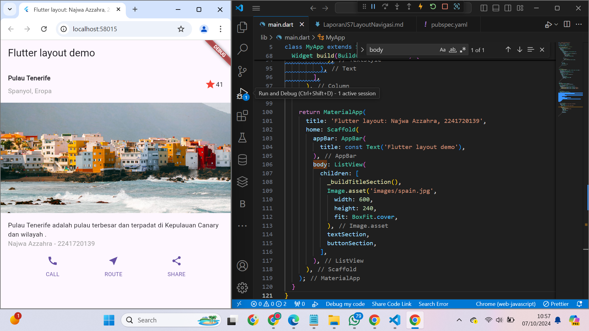

# Laporan Jobsheet 7 
# Layout dan Navigasi

### Najwa Azzahra
### TI-3C/19
### 2241720139

#### Praktikum 1
Langkah 2: Buka file lib/main.dart
```dart
import 'package:flutter/material.dart';

void main() => runApp(const MyApp());

class MyApp extends StatelessWidget {
  const MyApp({super.key});

  @override
  Widget build(BuildContext context) {
    return MaterialApp(
      title: 'Flutter layout: Najwa Azzahra | 2241720139',
      home: Scaffold(
        appBar: AppBar(
          title: const Text('Flutter layout demo'),
        ),
        body: const Center(
          child: Text('Hello World'),
        ),
      ),
    );
  }
}
```


Langkah 4: Implementasi title row

/* soal 1 */ Letakkan widget Column di dalam widget Expanded agar menyesuaikan ruang yang tersisa di dalam widget Row. Tambahkan properti crossAxisAlignment ke CrossAxisAlignment.start sehingga posisi kolom berada di awal baris.

/* soal 2 */ Letakkan baris pertama teks di dalam Container sehingga memungkinkan Anda untuk menambahkan padding = 8. Teks ‘Batu, Malang, Indonesia' di dalam Column, set warna menjadi abu-abu.

/* soal 3 */ Dua item terakhir di baris judul adalah ikon bintang, set dengan warna merah, dan teks "41". Seluruh baris ada di dalam Container dan beri padding di sepanjang setiap tepinya sebesar 32 piksel. Kemudian ganti isi body text ‘Hello World' dengan variabel titleSection seperti berikut:

```dart
import 'package:flutter/material.dart';

void main() => runApp(const MyApp());

class MyApp extends StatelessWidget {
  const MyApp({super.key});

  // Metode untuk membuat widget titleSection
  Widget _buildTitleSection() {
    return Container(
      padding: const EdgeInsets.all(32),
      child: Row(
        children: [
          Expanded(
            /* soal 1 */
            child: Column(
              crossAxisAlignment: CrossAxisAlignment.start,
              children: [
                /* soal 2 */
                Container(
                  padding: const EdgeInsets.only(bottom: 8),
                  child: const Text(
                    'Wisata Gunung di Batu',
                    style: TextStyle(
                      fontWeight: FontWeight.bold,
                    ),
                  ),
                ),
                Text(
                  'Batu, Malang, Indonesia',
                  style: TextStyle(color: Colors.grey),
                ),
              ],
            ),
          ),
          /* soal 3 */
          Icon(
            Icons.star,
            color: Colors.red,
          ),
          const Text('41'),
        ],
      ),
    );
  }

  @override
  Widget build(BuildContext context) {
    return MaterialApp(
      title: 'Flutter layout: Putri Ayu Aliciawati, 2241720132',
      home: Scaffold(
        appBar: AppBar(
          title: const Text('Flutter layout demo'),
        ),
        body: Column(
          children: [
            _buildTitleSection(), // Memanggil metode untuk mendapatkan section judul
          ],
        ),
      ),
    );
  }
}
```


#### Praktikum 2
Langkah 2: Langkah 2: Buat widget buttonSection
```dart
import 'package:flutter/material.dart';

void main() => runApp(const MyApp());

class MyApp extends StatelessWidget {
  const MyApp({super.key});

  // Metode untuk membuat widget titleSection
  Widget _buildTitleSection() {
    return Container(
      padding: const EdgeInsets.all(32),
      child: Row(
        children: [
          Expanded(
            /* soal 1 */
            child: Column(
              crossAxisAlignment: CrossAxisAlignment.start,
              children: [
                /* soal 2 */
                Container(
                  padding: const EdgeInsets.only(bottom: 8),
                  child: const Text(
                    'Wisata Gunung di Batu',
                    style: TextStyle(
                      fontWeight: FontWeight.bold,
                    ),
                  ),
                ),
                Text(
                  'Batu, Malang, Indonesia',
                  style: TextStyle(color: Colors.grey),
                ),
              ],
            ),
          ),
          /* soal 3 */
          Icon(
            Icons.star,
            color: Colors.red,
          ),
          const Text('41'),
        ],
      ),
    );
  }

  Column _buildButtonColumn(
      BuildContext context, Color color, IconData icon, String label) {
    return Column(
      mainAxisSize: MainAxisSize.min,
      mainAxisAlignment: MainAxisAlignment.center,
      children: [
        Icon(icon, color: color),
        Container(
          margin: const EdgeInsets.only(top: 8),
          child: Text(
            label,
            style: TextStyle(
              fontSize: 12,
              fontWeight: FontWeight.w400,
              color: color,
            ),
          ),
        ),
      ],
    );
  }

  @override
  Widget build(BuildContext context) {
    Color color = Theme.of(context).primaryColor;

    Widget buttonSection = Row(
      mainAxisAlignment: MainAxisAlignment.spaceEvenly,
      children: [
        _buildButtonColumn(context, color, Icons.call, 'CALL'),
        _buildButtonColumn(context, color, Icons.near_me, 'ROUTE'),
        _buildButtonColumn(context, color, Icons.share, 'SHARE'),
      ],
    );

    return MaterialApp(
      title: 'Flutter layout: Najwa Azzahra, 2241720139',
      home: Scaffold(
        appBar: AppBar(
          title: const Text('Flutter layout demo'),
        ),
        body: Column(
          children: [
            _buildTitleSection(), // Memanggil metode untuk mendapatkan section judul
            buttonSection,
          ],
        ),
      ),
    );
  }
}

```


#### Praktikum 3 
Langkah 2: Langkah 2: Buat widget buttonSection
```dart
import 'package:flutter/material.dart';

void main() => runApp(const MyApp());

class MyApp extends StatelessWidget {
  const MyApp({super.key});

  // Metode untuk membuat widget titleSection
  Widget _buildTitleSection() {
    return Container(
      padding: const EdgeInsets.all(16),
      child: Row(
        children: [
          Expanded(
            /* soal 1 */
            child: Column(
              crossAxisAlignment: CrossAxisAlignment.start,
              children: [
                /* soal 2 */
                Container(
                  padding: const EdgeInsets.only(bottom: 8),
                  child: const Text(
                    'Pulau Tenerife',
                    style: TextStyle(
                      fontWeight: FontWeight.bold,
                    ),
                  ),
                ),
                const Text(
                  'Spanyol, Eropa',
                  style: TextStyle(color: Colors.grey),
                ),
              ],
            ),
          ),
          /* soal 3 */
          const Icon(
            Icons.star,
            color: Colors.red,
          ),
          const Text('41'),
        ],
      ),
    );
  }

  // praktikum 2
  Column _buildButtonColumn(
      BuildContext context, Color color, IconData icon, String label) {
    return Column(
      mainAxisSize: MainAxisSize.min,
      mainAxisAlignment: MainAxisAlignment.center,
      children: [
        Icon(icon, color: color),
        Container(
          margin: const EdgeInsets.only(top: 8),
          child: Text(
            label,
            style: TextStyle(
              fontSize: 12,
              fontWeight: FontWeight.w400,
              color: color,
            ),
          ),
        ),
      ],
    );
  }

  @override
  Widget build(BuildContext context) {
    Color color = Theme.of(context).primaryColor;

    Widget buttonSection = Row(
      mainAxisAlignment: MainAxisAlignment.spaceEvenly,
      children: [
        _buildButtonColumn(context, color, Icons.call, 'CALL'),
        _buildButtonColumn(context, color, Icons.near_me, 'ROUTE'),
        _buildButtonColumn(context, color, Icons.share, 'SHARE'),
      ],
    );

    // praktikum 3
    Widget textSection = Container(
      padding: const EdgeInsets.all(16),
      child: Column(
        crossAxisAlignment: CrossAxisAlignment.start,
        children: [
          const Text(
            'Pulau Tenerife adalah pulau terbesar dan terpadat di Kepulauan Canary dan wilayah .',
            softWrap: true,
          ),
          const Text(
            'Najwa Azzahra - 2241720139',
            style: TextStyle(
              color: Colors.grey, // Mengatur warna teks menjadi abu-abu
            ),
          ),
        ],
      ),
    );

    return MaterialApp(
      title: 'Flutter layout: Najwa Azzahra, 2241720139',
      home: Scaffold(
        appBar: AppBar(
          title: const Text('Flutter layout demo'),
        ),
        body: SingleChildScrollView(
          child: Column(
            children: [
              _buildTitleSection(),
              textSection,
              buttonSection,
            ],
          ),
        ),
      ),
    );
  }
}
```


#### Praktikum 4
Langkah 1:  Siapkan aset gambar

```dart
  uses-material-design: true
  assets:
  - images/spain.jpg
```

Langkah 2:  Tambahkan gambar ke body

```dart
import 'package:flutter/material.dart';

void main() => runApp(const MyApp());

class MyApp extends StatelessWidget {
  const MyApp({super.key});

  // Metode untuk membuat widget titleSection
  Widget _buildTitleSection() {
    return Container(
      padding: const EdgeInsets.all(16),
      child: Row(
        children: [
          Expanded(
            child: Column(
              crossAxisAlignment: CrossAxisAlignment.start,
              children: [
                Container(
                  padding: const EdgeInsets.only(bottom: 8),
                  child: const Text(
                    'Pulau Tenerife',
                    style: TextStyle(
                      fontWeight: FontWeight.bold,
                    ),
                  ),
                ),
                const Text(
                  'Spanyol, Eropa',
                  style: TextStyle(color: Colors.grey),
                ),
              ],
            ),
          ),
          const Icon(
            Icons.star,
            color: Colors.red,
          ),
          const Text('41'),
        ],
      ),
    );
  }

  // praktikum 2
  Column _buildButtonColumn(
      BuildContext context, Color color, IconData icon, String label) {
    return Column(
      mainAxisSize: MainAxisSize.min,
      mainAxisAlignment: MainAxisAlignment.center,
      children: [
        Icon(icon, color: color),
        Container(
          margin: const EdgeInsets.only(top: 8),
          child: Text(
            label,
            style: TextStyle(
              fontSize: 12,
              fontWeight: FontWeight.w400,
              color: color,
            ),
          ),
        ),
      ],
    );
  }

  @override
  Widget build(BuildContext context) {
    Color color = Theme.of(context).primaryColor;

    Widget buttonSection = Row(
      mainAxisAlignment: MainAxisAlignment.spaceEvenly,
      children: [
        _buildButtonColumn(context, color, Icons.call, 'CALL'),
        _buildButtonColumn(context, color, Icons.near_me, 'ROUTE'),
        _buildButtonColumn(context, color, Icons.share, 'SHARE'),
      ],
    );

    // praktikum 3
    Widget textSection = Container(
      padding: const EdgeInsets.all(16),
      child: Column(
        crossAxisAlignment: CrossAxisAlignment.start,
        children: [
          const Text(
            'Pulau Tenerife adalah pulau terbesar dan terpadat di Kepulauan Canary dan wilayah .',
            softWrap: true,
          ),
          const Text(
            'Najwa Azzahra - 2241720139',
            style: TextStyle(
              color: Colors.grey, // Mengatur warna teks menjadi abu-abu
            ),
          ),
        ],
      ),
    );

    return MaterialApp(
      title: 'Flutter layout: Najwa Azzahra, 2241720139',
      home: Scaffold(
        appBar: AppBar(
          title: const Text('Flutter layout demo'),
        ),
        body: ListView(
          children: [
            _buildTitleSection(),
            Image.asset('images/spain.jpg',
              width: 600,
              height: 240,
              fit: BoxFit.cover,
            ),
            textSection,
            buttonSection,
          ],
        ),
      ),
    );
  }
}
```
