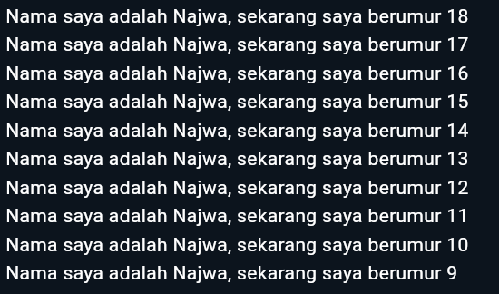

## Najwa Azzahra

## TI-3C/19

## 2241720139

# Pertemuan Minggu 2

1. Modifikasilah agar mendapatkan keluaran (output) sesuai yang diminta!

**Jawaban**

```
void main () {
  for (int i = 18; i >= 9; i--) {
    print('Nama saya adalah Najwa, sekarang saya berumur ${i}');
  }
}
```



2. Mengapa sangat penting untuk memahami bahasa pemrograman Dart sebelum kita menggunakan framework Flutter ? Jelaskan!

**Jawaban**

Karena Flutter sepenuhnya dibangun di atas Dart, sehingga setiap komponen, widget, dan logika aplikasi menggunakan Dart sebagai bahasa dasar

3. Rangkumlah materi dari codelab ini menjadi poin-poin penting yang dapat Anda gunakan untuk membantu proses pengembangan aplikasi mobile menggunakan framework Flutter.

**Jawaban**

1. Dart menggunakan virtual machine
2. Arithmetic operators

   a. + untuk tambahan.

   b. - untuk pengurangan.

   c. \* untuk perkalian.

   d. / untuk pembagian.

   e. ~/ untuk pembagian bilangan bulat. Di Dart, setiap

   pembagian sederhana dengan / menghasilkan nilai double. Untuk mendapatkan nilai bilangan bulat, Anda perlu membuat semacam transformasi (yaitu, typecast) dalam bahasa pemrograman lain; namun Dart sudah mendukung untuk operasi ini.

   f. % untuk operasi modulus (sisa bagi dari bilangan bulat).

   g. -expression untuk negasi (yang membalikkan suatu nilai).

3. Increment and decrement operators

   a. ++var atau var++ untuk menambah nilai variabel var sebesar 1

   b. --var atau var-- untuk mengurangi nilai variabel var sebesar 1

4. Equality and relational operators

   a. == untuk memeriksa apakah operan sama

   b. != untuk memeriksa apakah operan berbeda

   Untuk melakukan pengujian relasional, maka gunakan operator sebagai berikut:

   a. memeriksa apakah operan kiri lebih besar dari operan kanan

   b. < memeriksa apakah operan kiri lebih kecil dari operan kanan

   c. >= memeriksa apakah operan kiri lebih besar dari atau sama dengan operan kanan

   d. <= memeriksa apakah operan kiri kurang dari atau sama dengan operan kanan

5. Logical operators

   a. !expression negasi atau kebalikan hasil ekspresi—yaitu, true menjadi false dan false menjadi true.

   b. || menerapkan operasi logika OR antara dua ekspresi.

   c. && menerapkan operasi logika AND antara dua ekspresi.

6. Dart adalah dasar dari flutter
